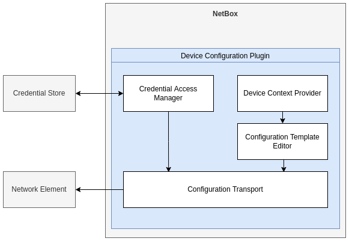

# NetBox Config Manager

This is a proof of concept [NetBox](https://github.com/netbox-community/netbox) plugin which allows you to
configure network devices via NETCONF, via manually created templates,
which source data from NetBox.

This POC was developed as part of a bachelor thesis at [ZHAW](https://www.zhaw.ch/en/).
The thesis itself can be found here:

 - https://github.com/Jenjen1324/BA-2022---NETCONF/releases/tag/ba-delivery

## Overview

The plugin is composed of the following parts:

### Device Context Provider

This part lets you store GraphQL queries which are used to retrieve data from NetBox.
The queries will be executed against the native NetBox GraphQL API. The results of the queries
can then be used in the templates.

### Configuration Template Editor

This part lets you create templates which can be used to configure network devices.
The templates are written in Jinja2 and can use the data retrieved from the Device Context Provider.

A critical part for ease of use is a "smart" editor, which is provided through the ace editor.
It provides syntax highlighting, auto-completion and other features, making the editing process
easier.

### Credential Access Manager

This part lets you store credentials for devices. This part utilizes Hashicorp Vault as the backing storage.
The UI also allows one to configure access controls for the credentials based on NetBox users and groups.

### Configuration Transport

The plugin is designed to be extensible with any configuration transport mechanism. Currently,
only NETCONF is supported, through the [`ncclient`](https://github.com/ncclient/ncclient) library.

## Improvements and Ideas

As this is a proof of concept, there is lots of things that should get improved and added.
To name a few things:

 - [ ] Add support for other configuration transport mechanisms
 - [ ] NETCONF supports multiple configuration formats, currently only XML is supported
 - [ ] NETCONF supports validating the configuration before applying it through the use of YANG models
 - [ ] Comparing state and desired state
 - [ ] Ansible plays a critical role in current automation setups, consider integrating with it

## Setup

This is not intended for production use, therefore no extensive setup instructions are provided yet.
The repository is setup more as a development environment for the plugin, and some instructions to
get it running are provided in `plugin_setup.md`. Further, the Hashicorp Vault instance configured in
`docker-compose.yml` needs to be set up manually.